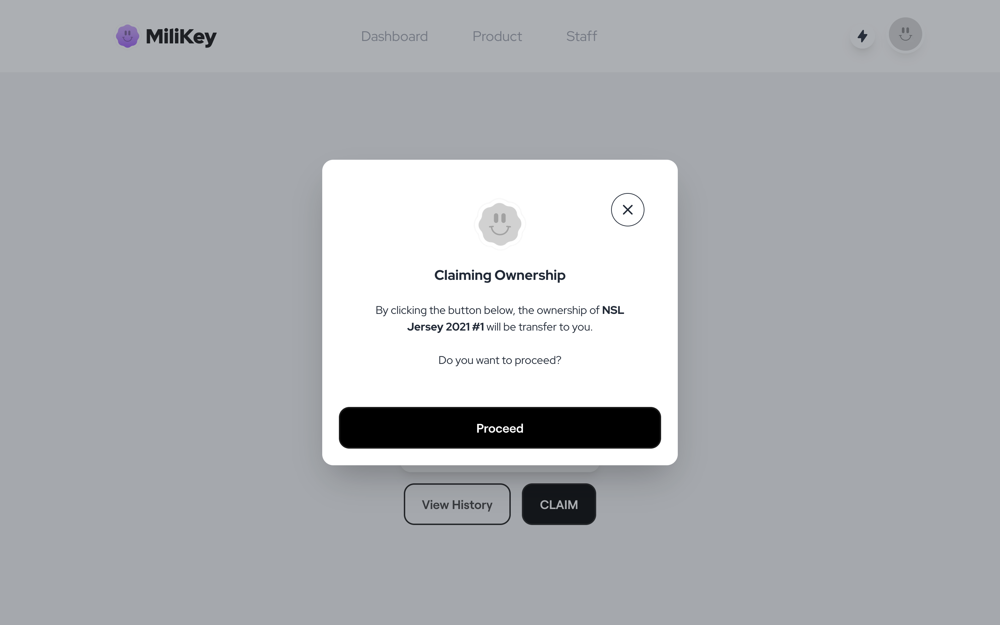

<!-- PROJECT LOGO -->
 

  
   
   

  <h1 align="center">MiliKey: Product Ownership Management System using Blockchain Technology</h1>
   

<!-- ABOUT THE PROJECT -->
## About The Project

Today, the acceleration of digital transition, especially in the e-commerce industry, allows everyone to sell and buy various products easily and has indirectly contributed to the increase in the selling of counterfeit products. Besides, it will be tricky for the consumer to check the product's authenticity, as the consumer only can rely on the product's image and descriptions. At the same time, the counterfeiter has a significant advantage in manipulating the authenticity of the products. 

Hence, Kaki Jersi Sdn Bhd (KJ), a local manufacturer of sporting products affected by the selling of counterfeit products as there is no suitable platform for their consumer to verify their product authenticity. In addition, KJ also faces the problem of tracking and tracing back the lost products from their inventory as they have no inventory system. 

As a result, the MiliKey: Product Ownership Management System using Blockchain Technology is developed to help the consumer verify the product's authenticity without worrying about the trustworthiness as the data is stored in the blockchain network. Also, blockchain technology is utilized by this system through the KJ's supply chain to track and trace their products. 

Thus, the ABCDE methodology is adopted in developing this project that only involves three phases: Requirements Gathering and Analysis, Design, and Implementation phase. Two subsystems are developed, including the web-app subsystem and the smart contract subsystem that makes the system interact with the Ethereum blockchain network. 

The system provides several features, such as product authenticity verification, claiming and transferring the ownership of a product, and view ownership history. Blockchain technology supports these features by making the ownership information to be secure and transparent. 

Hence, the strengths of the system are providing proof of ownership for the consumers that benefit them to sell the products in the secondary market and full transparency ownership information for all users. 

However, there are some system limitations, which are the users must have a MetaMask account before interacting with the blockchain, and the systems cannot support the bulk upload products for the big production. 

Therefore, several improvements can be made, including implementing the ERC721A token standard, transfer ownership features, and e-mail notifications for every blockchain transaction.

 
 
### Built With

[![Next][Next.js]][Next-url] [![React][React.js]][React-url] [![Laravel][Laravel.com]][Laravel-url] [![Tailwind][Tailwind.com]][Tailwind-url] [![MySQL][MySQL.com]][MySQL-url]
 
 
 

<!-- USE CASE -->
## Use Case Diagram

  
 
 
 

<!-- GETTING STARTED -->
## Screenshots of the system

  
 
 

 
 

 
 

 
 

   

<!-- MARKDOWN LINKS & IMAGES -->
<!-- https://www.markdownguide.org/basic-syntax/#reference-style-links -->
[contributors-shield]: https://img.shields.io/github/contributors/othneildrew/Best-README-Template.svg?style=for-the-badge
[contributors-url]: https://github.com/othneildrew/Best-README-Template/graphs/contributors
[forks-shield]: https://img.shields.io/github/forks/othneildrew/Best-README-Template.svg?style=for-the-badge
[forks-url]: https://github.com/othneildrew/Best-README-Template/network/members
[stars-shield]: https://img.shields.io/github/stars/othneildrew/Best-README-Template.svg?style=for-the-badge
[stars-url]: https://github.com/othneildrew/Best-README-Template/stargazers
[issues-shield]: https://img.shields.io/github/issues/othneildrew/Best-README-Template.svg?style=for-the-badge
[issues-url]: https://github.com/othneildrew/Best-README-Template/issues
[license-shield]: https://img.shields.io/github/license/othneildrew/Best-README-Template.svg?style=for-the-badge
[license-url]: https://github.com/othneildrew/Best-README-Template/blob/master/LICENSE.txt
[linkedin-shield]: https://img.shields.io/badge/-LinkedIn-black.svg?style=for-the-badge&logo=linkedin&colorB=555
[linkedin-url]: https://linkedin.com/in/othneildrew
[product-screenshot]: images/screenshot.png
[Next.js]: https://img.shields.io/badge/next.js-000000?style=for-the-badge&logo=nextdotjs&logoColor=white
[Next-url]: https://nextjs.org/
[React.js]: https://img.shields.io/badge/React-20232A?style=for-the-badge&logo=react&logoColor=61DAFB
[React-url]: https://reactjs.org/
[Laravel.com]: https://img.shields.io/badge/Laravel-FF2D20?style=for-the-badge&logo=laravel&logoColor=white
[Laravel-url]: https://laravel.com
[Tailwind.com]: https://img.shields.io/badge/Tailwind_CSS-38B2AC?style=for-the-badge&logo=tailwind-css&logoColor=white
[Tailwind-url]: https://getbootstrap.com
[MySQL.com]: https://img.shields.io/badge/MySQL-00000F?style=for-the-badge&logo=mysql&logoColor=white
[MySQL-url]: https://jquery.com 
